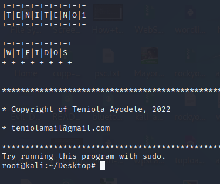
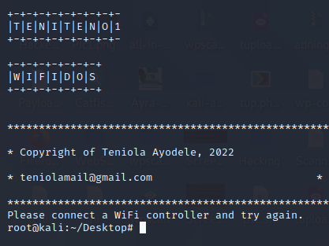

<!DOCTYPE html>
<html>
<head>
<body>
<h1>WifiDos:</h1>

WifiDos is a python script that can DOS or ShutDown Wifi Network

<h2>INSTALLATION AND USAGE:</h2>

$ apt update

$ apt upgrade

$ apt install python3

$ apt install git

$ git clone https://github.com/Hackers-Unit/WifiDos

$ cd WifiDos

$ sudo python3 WifiDos.py

<h2>SCREENSHOT:</h2>

<h2>NOTE:</h2>

Follow me on github for more tools

</body>
</head>
</html>
